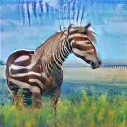
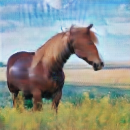
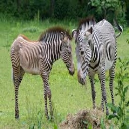
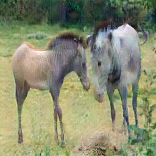
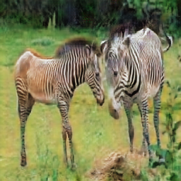

[](http://makeapullrequest.com) 

# Cycle-GAN-PyTorch
>  PyTorch implementation of the Cycle GAN paper.

**Cycle GAN**: An approach for learning to translate an image from a source domain *X* to a target domain *Y* in the absence of paired examples.

- This repo covers only the Cycle GAN architecture with 9 residual blocks that is suitable for images with 256 x 256 size. 

## Demo

Original image| Fake image| Reconstructed image
:-------------------:|:----------------:|:-----------------------------:|
| | 
| | 


## Dataset tested
- [x] Horse to Zebra & Vice Versa
- [ ] Apple to Orange & Vice Versa

## Dependencies

- imageio == 2.9.0
- numpy == 1.19.2
- opencv_contrib_python == 4.4.0.44
- torch == 1.6.0
- torchsummary == 1.5.1
- tqdm == 4.50.0

## Installation

```bash
pip3 install -r requirements.txt
```
## Usage

The training requires a suitable (not necessarily a 1080 Ti or a 2080 RTX Nvidia gpu :grin:) gpu-enabled machine. Google Colab provides what is enough to train such an algorithm but if you a more powerful free online gpu provider, take a look at: [paperspace.com](paperspace.co).  
- **To run the code**:  
```shell
python3 main.py
```
- **If the weights with name `CycleGan.pth` is available in the directory, then automatically the training procedure would be continued otherwise, it starts from scratch. **.  
- **If you want to test the algorithm,  turn `TRAIN_FLAG` flag to `False`**. Modify the name of your testing instances accordingly in the `main.py`.

## Reference
1. [_Unpaired Image-to-Image Translation using Cycle-Consistent Adversarial Networks_,  Zhu et al., 2017](https://arxiv.org/abs/1703.10593)

## Acknowledgement

Most of the materials is inspired by the [original implmentation](https://github.com/junyanz/pytorch-CycleGAN-and-pix2pix) and the [TensorFlow's great tutorial](https://www.tensorflow.org/tutorials/generative/cyclegan) especially about pre-processing images.